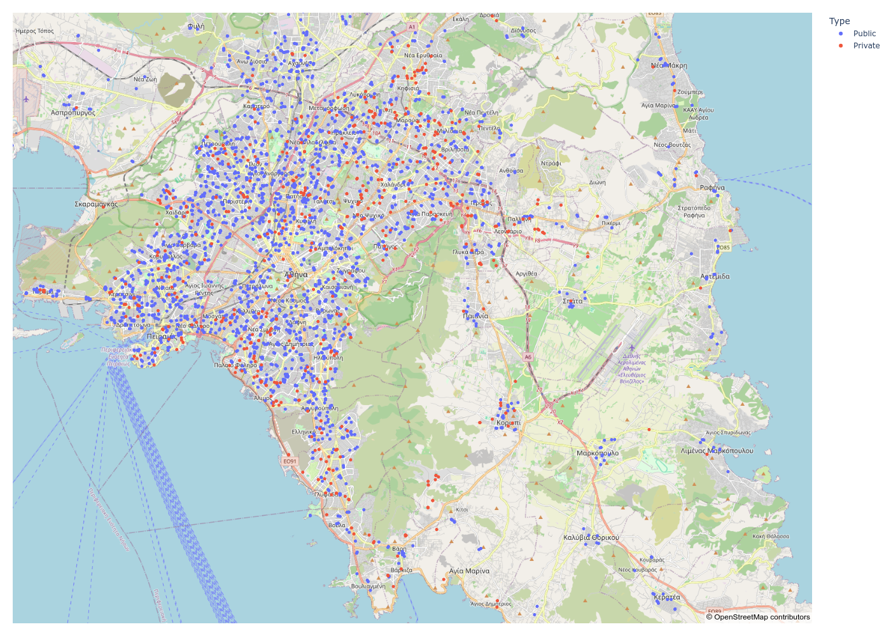
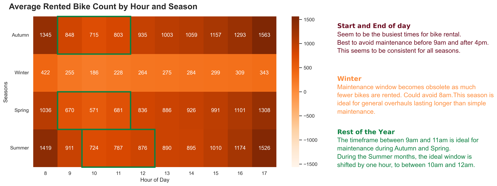

# Portfolio

Just a collection of projects I have worked on, showcasing relevant skills and
experience, as well as interests.
 
See the respective project folder for more details.

## Projects

### [House Hunting - Population Density in Athens](./house_hunting)
Identifying less densely populated areas in Athens, Greece, using the number of
schools as a proxy for population density.

### [Seoul Rented Bicycle Maintenance](./seoul_bike_maintenance)
Analyze bike rentals to determine the ideal time for bike maintenance, during
work days and work hours.
 
 
[Sample Presentation](https://docs.google.com/presentation/d/1RnRQp53HwqKMF9N3SkRMI_IWr_BgNFuVfi5YAsxs8as/)
 
 
**Overview**:

### [Multi-label dataset train/test split](./multi_label_dataset_split)
Splitting a multi-label dataset into train and test sets, ensuring that all
labels are represented in both sets, using [scikit-multilearn](http://scikit.ml/).
 
Used it to find the 10 images to use in a questionaire about human `Perception of Anthropomorphic Traits in Cars`.
