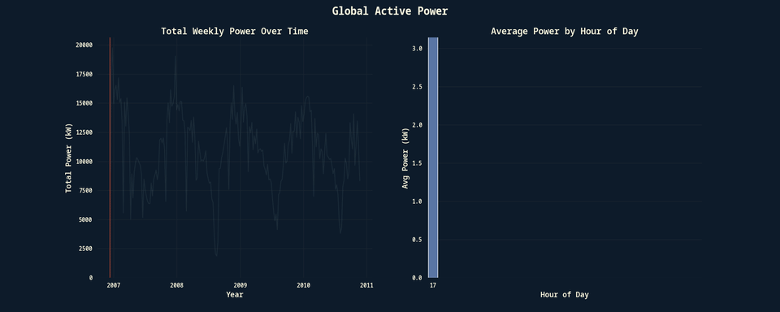
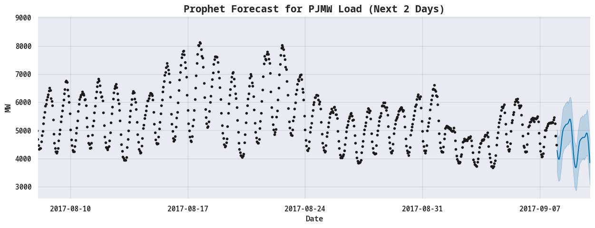

# Portfolio

Just a collection of projects I have worked on, showcasing relevant skills and
experience, as well as interests.
 
See the respective project folder for more details.
 
 
Also check out my [Blog](https://ioanniswd.github.io/) containing some more
information on side projects and other topics.

## Projects

### [House Hunting - Population Density in Athens](./house_hunting)
Identifying less densely populated areas in Athens, Greece, using the number of
schools as a proxy for population density.

### [Seoul Rented Bicycle Maintenance](./seoul_bike_maintenance)
Analyze bike rentals to determine the ideal time for bike maintenance, during
work days and work hours.
 
 
[Sample Presentation](https://docs.google.com/presentation/d/1RnRQp53HwqKMF9N3SkRMI_IWr_BgNFuVfi5YAsxs8as/)
 
 
**Overview**:

### [Multi-label dataset train/test split](./multi_label_dataset_split)
Splitting a multi-label dataset into train and test sets, ensuring that all
labels are represented in both sets, using [scikit-multilearn](http://scikit.ml/).
 
Used it to find the 10 images to use in a questionaire about human `Perception of Anthropomorphic Traits in Cars`.

### [Customer Clustering](./customer-clustering)
Using [this customer segmentation dataset](https://www.kaggle.com/datasets/imakash3011/customer-personality-analysis) from Kaggle, I performed a customer segmentation analysis using K-means clustering.
 
The notebook contains the EDA, data preprocessing, hyperparameter tuning, and
the final model, as well as a statistical analysis of the clusters and some
actionable insights.

### [Adjusting Monthly Targets to a Daily Level](./target-adjustment)
Targets are usually provided on a monthly, quarterly, or yearly level.
However, when tracking performance, we want to see if we are on track to meet
our targets on a daily basis, not at the end of the month, quarter or year, in
order to make adjustments in time.
 
Using the [Walmart sales dataset](https://www.kaggle.com/datasets/devarajv88/walmart-sales-dataset) from Kaggle, I adjusted monthly sales targets to a daily level, using a number of Machine Learning models, including XGBoost, Random Forest, and Linear Regression.

### [Creating Animated Plots using Multiprocessing in Python](./animated-plotting)
Using the [Household Electric Power Consumption](https://www.kaggle.com/datasets/uciml/electric-power-consumption-data-set) I created a set of visualizations which I later animated using `ffmpeg`.

### [Energy Load Forecasting using Facebook Prophet](./energy-load-forecasting)

Scenario: 
A company creates an app that helps minimize energy costs for users,
figuring out when to use batteries and when to use the grid. To do this, they need to forecast the energy load for the next 2 days.

I used the [Hourly Energy Consumption](https://www.kaggle.com/datasets/robikscube/hourly-energy-consumption) dataset from Kaggle, which contains data for several years and predicted the energy load for every hour in the next 2 days using Facebook Prophet.
I used a rolling origin evaluation, Mean Absolute Error (MAE) and Mean
Absolute Percentage Error (MAPE) to evaluate the model.

