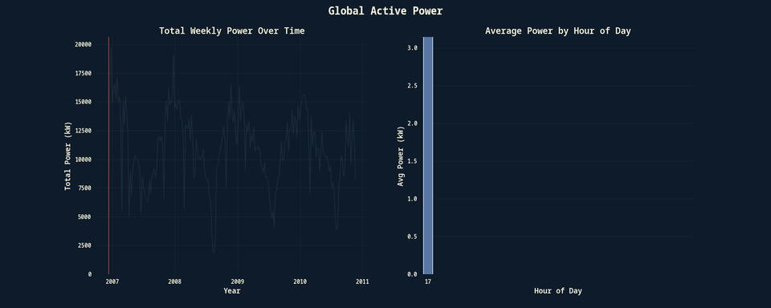

# Creating Animated Plots using Multiprocessing in Python

This project is inspired by the wonderful work of [Dave's Space](https://github.com/davesspace), offering a practical example on how to use Python's `multiprocessing` package to speed up the generation of image frames for animations using `matplotlib`.

Source:
- [Github Repo](https://github.com/davesspace/example-multiprocessing-plots)
- [YouTube Video](https://www.youtube.com/watch?v=NZ3QWpW8kv8)

 

This notebook uses the [Household Electric Power Consumption](https://www.kaggle.com/datasets/uciml/electric-power-consumption-data-set) dataset and a predefined visualization configuration and creates the frames to be used in an animation.
Then, using `ffmpeg`, it creates a video or a gif from the generated frames.

### Example
Here is the **Total Weekly Power in KW** over time, and a bar chart showing the **Avg Power in KW** per hour of day.
 
 

