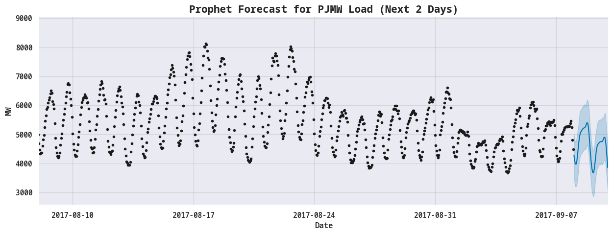
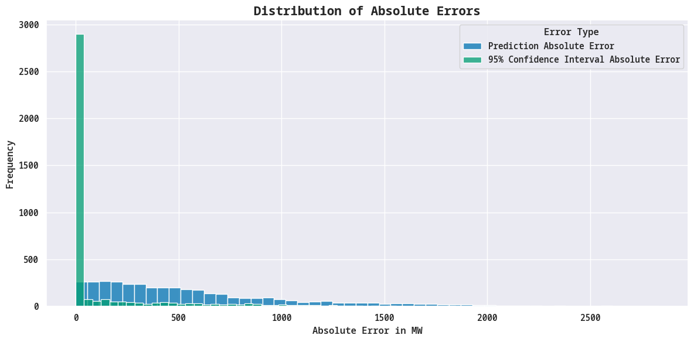
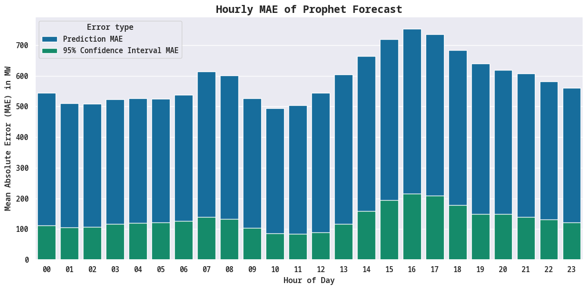

# Energy Load Forecasting using Facebook Prophet

A company creates an app that helps minimize energy costs for users,
figuring out when to use batteries and when to use the grid. 
To do this, they need to forecast the energy load for the next 2 days.

I used the [Hourly Energy Consumption](https://www.kaggle.com/datasets/robikscube/hourly-energy-consumption) dataset from Kaggle, which contains data for several years and predicted the energy load for every hour in the next 2 days using Facebook Prophet.
I used a rolling origin evaluation, Mean Absolute Error (MAE) and Mean
Absolute Percentage Error (MAPE) to evaluate the model.

Here is a sneak peek of the results:

The model is about 10% off in its predictions (MAPE ~= 0.1MW) or about 589MW on
average (MAE = 589MW). Using the
confidence intervals we can reduce the error to about 2% on average or 134MW on
average. The confidence interval contains the actual energy consumption about 73% of the
time, for the validation set.

