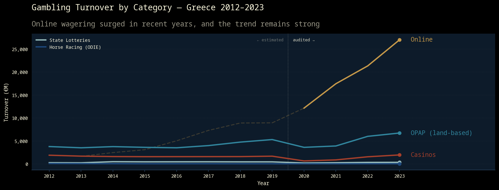

# Gambling in Greece

Analysis of the Greek gambling market using annual reports published by the Hellenic Gaming Commission (ΕΕΕΠ), covering 2012–2024.



## Overview

The notebook explores the financial evolution of Greek gambling across five categories — OPAP land-based, Online, Casinos, State Lotteries, and Horse Racing — using three metrics: total wagers (TGR), gross revenue (GGR), and operator hold percentage.

Key findings:
- Online gambling has grown relentlessly, overtaking all land-based channels combined in total wagers
- Despite dominating turnover, online's very low hold rate (~4–5%) means OPAP land-based still leads on gross revenue — though the gap is closing
- OPAP and Online together account for 86.9% of total GGR (€2.5B of €2.9B in 2024)
- Horse racing was effectively suspended in January 2024 as operator Ιπποδρομίες A.E. fell below the minimum active-horse threshold

## Notebook

The analysis is a [marimo](https://marimo.io/) reactive notebook (`analysis.py`). To run it locally:

```bash
pip install marimo
marimo edit analysis.py
```

The analysis is also available as a [PDF report](./analysis.pdf) and can be updated with:
```bash
marimo export pdf analysis.py -o analysis.pdf
```

## Data

Financial data covering 2012–2024, sourced from 13 HGC annual reports. Metrics include Gross Gaming Revenue (GGR) and total wagers (TGR/Turnover), broken down by gambling category.

**Important caveat:** Online gambling figures for 2013–2019 are partly derived or estimated. During this period the online market operated under a transitional licensing regime (Art. 50, Law 4002/2011), so operators self-declared revenues without full ΕΕΕΠ audit. From 2020 onward all figures come from audited regulatory tables.

For full data documentation — file mapping, methodology, and year-by-year notes — see [`data/hgc_reports/README.md`](data/hgc_reports/README.md).

The structured dataset is at [`data/financial_data.csv`](data/financial_data.csv).
