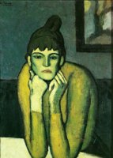
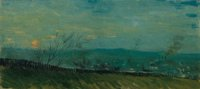
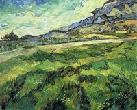
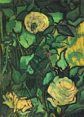
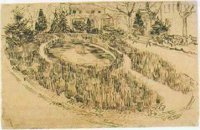
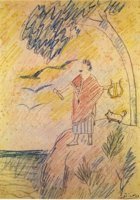
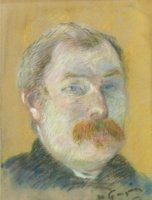

# Painting Search

Search a collection of paintings by color. Dominant colors are extracted from each image using K-Means clustering on randomly sampled pixels, then stored in Neo4j as a color knowledge graph. Queries support both exact color matches and perceptual adjacency — asking for "blue" returns paintings with navy, petrol, cerulean, and sky blue as well, using Neo4j's native vector index on CIE LAB color space.

The color vocabulary covers ~960 named colors: the full [xkcd color survey](https://xkcd.com/color/rgb/) plus classical art pigment names (burnt sienna, ultramarine, viridian, etc.).

## Data

Download the [Artistic Painting Dataset](https://www.kaggle.com/datasets/programmer3/artistic-painting-dataset) from Kaggle and extract it into `images/`:

```bash
kaggle datasets download -d programmer3/artistic-painting-dataset -p images/ --unzip
```

The dataset extracts into `images/images/`, organized by artist (20 artists, ~4,100 paintings). The script scans subdirectories recursively, so `--images-dir images/images/` is all you need.

## Setup

**1. Start Neo4j**

The vector index this project uses requires Neo4j 5.11+. The quickest way to run it locally is Docker:

```bash
docker run \
  --name neo4j \
  -p 7474:7474 -p 7687:7687 \
  -e NEO4J_AUTH=none \
  -v $HOME/neo4j/data:/data \
  neo4j:latest
```

The `-v` flag mounts `~/neo4j/data` on your machine to Neo4j's data directory inside the container. All nodes, relationships, and vector indexes are persisted there — removing the container does not lose your data.

The browser UI is available at `http://localhost:7474`. To stop and restart later:

```bash
docker stop neo4j
docker start neo4j
```

**2. Install dependencies**

```bash
uv sync
```

**3. Create a `.env` file** from the example and fill in your Neo4j credentials:

```bash
cp .env.example .env
```

```
NEO4J_URI=bolt://localhost:7687
NEO4J_USER=neo4j
NEO4J_PASSWORD=
```

## Usage

**Step 1 — Benchmark** to find the right `sample_size` for your machine before processing the full dataset. The benchmark runs a few images across a range of pixel sample counts and prints timing alongside the extracted colors, so you can see where the results stabilize:

```bash
uv run python scripts/pipeline.py --images-dir images/images/ --benchmark
```

By default the benchmark uses the first N images (alphabetically). Pass `--image-select random` to sample randomly instead:

```bash
uv run python scripts/pipeline.py --images-dir images/images/ --benchmark --image-select random
```

Once you have a good `sample_size`, update it in `config.toml`.

**Step 2 — Extract colors and populate Neo4j:**

```bash
uv run python scripts/pipeline.py --images-dir images/images/
```

To process only a subset — useful for testing end-to-end before committing to the full dataset:

```bash
# First 10 images
uv run python scripts/pipeline.py --images-dir images/images/ --limit 10

# Random 20%
uv run python scripts/pipeline.py --images-dir images/images/ --limit 20% --image-select random
```

Individual config values can be overridden per-run with CLI flags:

| Flag | Config key | Description |
|---|---|---|
| `--images-dir` | — | Folder containing painting images |
| `--sample-size` | `sample_size` | Random pixels sampled per image |
| `--n-colors` | `n_colors` | Dominant colors extracted per painting |
| `--image-select` | — | Image selection strategy: `first` (default) or `random` |
| `--limit` | — | Process a subset: `10` for 10 images, `20%` for 20 percent |
| `--benchmark` | — | Run benchmark then exit |
| `--profile` | — | Print per-step timing breakdown for one image, then exit |
| `--profile-runs` | — | Repetitions to average in profile mode (default: 5) |

## Configuration

All tunable parameters live in [`config.toml`](config.toml), each with an inline description:

| Key | Default | Description |
|---|---|---|
| `sample_size` | `50000` | Pixels randomly sampled per image before clustering |
| `n_colors` | `8` | K-Means clusters (dominant colors) per painting |
| `image_extensions` | `jpg, jpeg, png` | File types scanned in `--images-dir` |
| `neo4j_batch_size` | `100` | Painting nodes written per Neo4j UNWIND batch |
| `color_batch_size` | `200` | Color nodes written per Neo4j UNWIND batch |
| `benchmark.n_images` | `3` | Images used during the benchmark |
| `benchmark.sample_sizes` | `10k … full` | Sample sizes tested by the benchmark (`0` = full pixel count) |

## Claude Skill

This project includes a [`SKILL.md`](SKILL.md) for use with Claude Code or any agent that supports skill files. Load it and you can search the collection in plain English — the agent translates your request into a Cypher query, runs it against Neo4j, and displays matching paintings with images.

```
Find me paintings that feel warm and earthy
Show me something with the color of deep ocean water
I want a painting that is predominantly white and gold
```

## Examples

**"Find paintings with the color of luxury green"**

    

*Picasso 146 · Van Gogh 448 · Van Gogh 417 · Van Gogh 451 · Van Gogh 512*

---

**"Find paintings with the color of sand"**

    

*Picasso 15 · Van Gogh 530 · Picasso 407 · Gauguin 83 · Kandinsky 61*

---

## Queries

See [`cypher/queries.cypher`](cypher/queries.cypher) for annotated examples including:

- Exact multi-color match ("white AND gold in top 3")
- Perceptual adjacency via vector KNN ("blue and similar")
- Mood/family search ("warm", "cool", "earthy")
- Dominant color, high contrast, and exclusion queries
