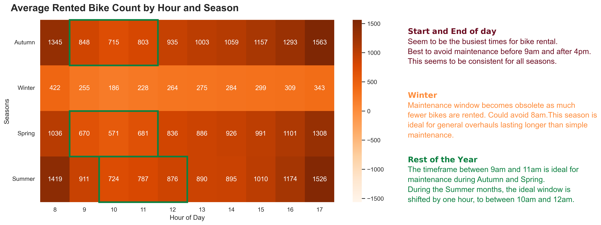

# Seoul Rented Bicycle Maintenance
A project from [Google Advanced Data Analytics Professional Certificate](https://www.coursera.org/professional-certificates/google-advanced-data-analytics) on Coursera.

## Project Description
Analyze bike rentals to determine the ideal time for bike maintenance, during
work days and work hours.

## Analysis
[Seoul Rented Bicycle Maintenance Notebook](./seoul_bikes.sync.ipynb)

### Sample presentation
[Seoul Rented bicycle maintenance slides](https://docs.google.com/presentation/d/1RnRQp53HwqKMF9N3SkRMI_IWr_BgNFuVfi5YAsxs8as/)

### Image to include in a written report shared with stakeholders.

