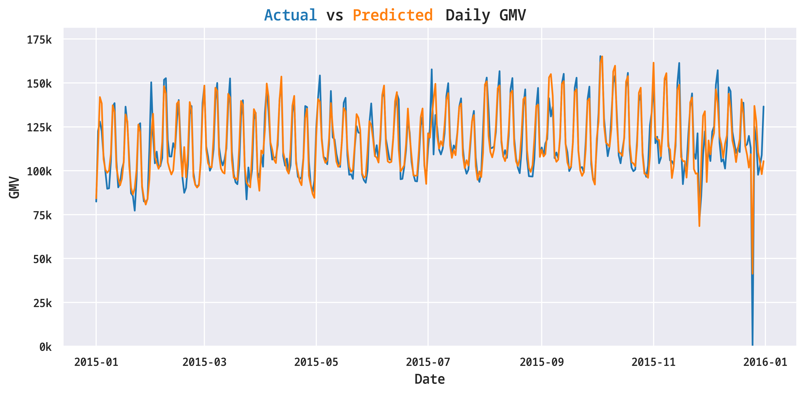

# Adjusting Monthly Targets to a Daily Level

Targets are usually provided on a monthly, quarterly, or yearly level.
However, when tracking performance, we want to see if we are on track to meet
our targets on a daily basis, not at the end of the month, quarter or year, in
order to make adjustments in time.
 
This notebook demonstrates how to adjust monthly targets to a daily level
using the Walmart sales dataset. It utilizes features such as holidays,
day of the week, and other calendar features to create a daily target
dataset, based on the monthly targets and on the historical sales data.

## Results

